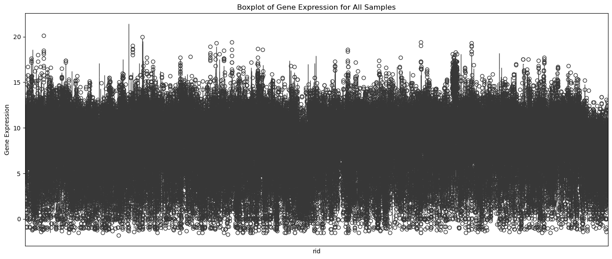
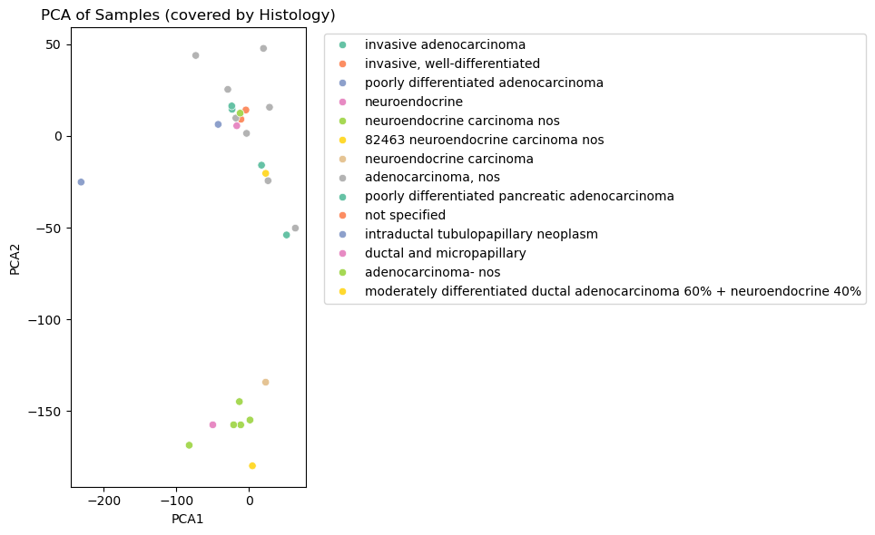
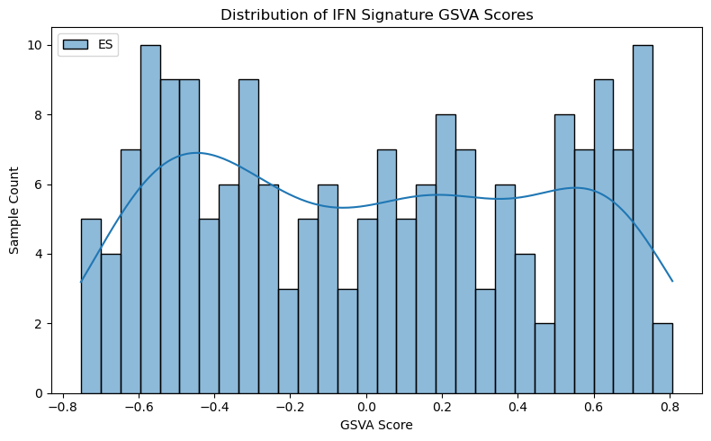

## Background

Pancreatic Adenocarcinoma (PAAD) is the third most common cause of death from cancer, with an overall 5-year survival rate of less than 5%, and is predicted to become the second leading cause of cancer mortality in the United States by 2030.

---

## Objectives

1. Remove genes with missing values.
2. Visualize gene expression distribution.
3. Perform PCA to identify sample clustering patterns.
4. Identify and remove Neuroendocrine from the cohort.
5. Score interferon gene set activation using GSVA.
6. Identify high and low IFN subtypes in the data.

---

## Methods

- **Expression Data**: `PAAD.gct`, containing gene expression data of roughly 20,000 genes across 185 samples.
- **Gene Signature**: `type1_IFN.txt`, contains 25 type 1 IFN genes.
- **Libraries**: `cmapPy`, `gseapy`, `matplotlib`, `seaborn`, `sklearn`.

---

## Results

### 1. Filtering Out Missing Values

- **Removed genes with NaNs**: 4,367 genes were removed from data set due to having missing values.

### 2. Gene Expression Distribution

This boxplot shows consistent distribution of gene expressoin across all samples.

### 3. PCA Analysis

PCA was used to visualize sample clustering. Neuroendocrine tumors show partial separation from exocrine tumors based on gene expression.

### 4. GSVA - IFN Signature Scoring

GSVA was performed using the IFN signature. Each sample was assigned a score representing the activation level of the IFN gene.

---

## Conclusion

This analysis demonstrates that:
- Neuroendocrine tumors exhibit distinct expression patterns and were excluded.
- Samples with high GSVA scores coorelate to high IFN subtypes, and similarly for low scores with low subtypes.

---

## Notebook & Code

The original Jupyter Notebook (`PAAD_IFN_analysis.ipynb`) contains all code and outputs to produce these results.